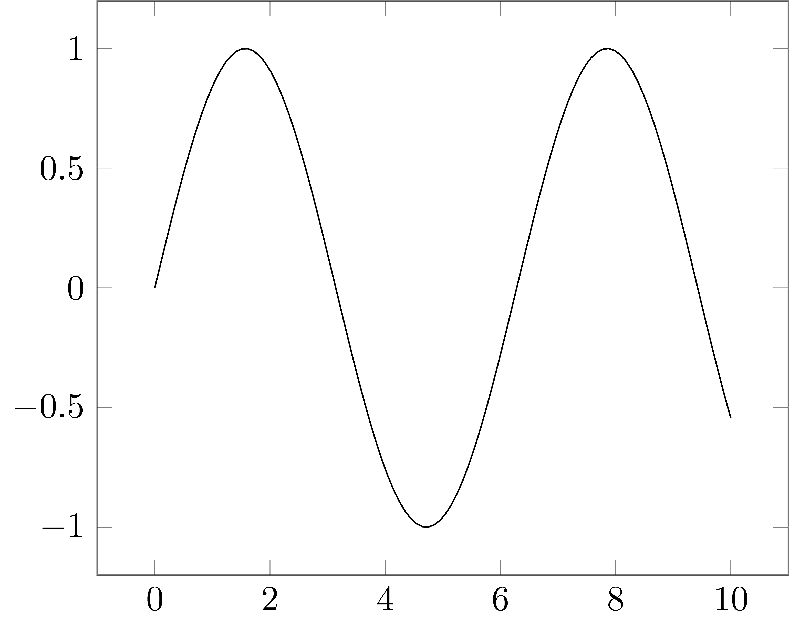
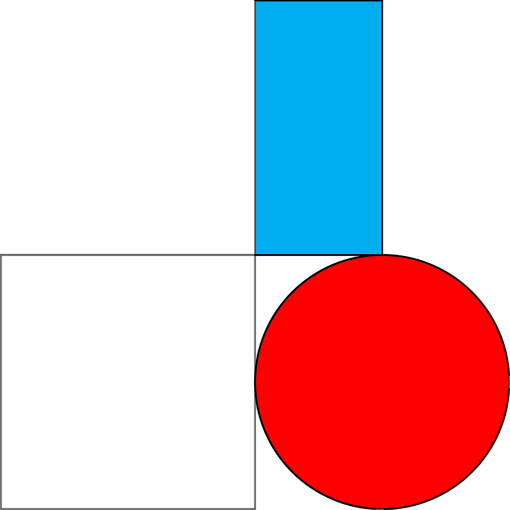

<div align="center">
    <h1>Pykz</h1>
    A Python library to generate tikz code.
</div> 

Generate beautiful, publication-ready figures with the power of Tikz and pgfplots,
with a comfortable, familiar Python syntax.

pykz aims to provide a syntax similar to matplotlib,
but with the possibility of directly outputting (and controlling!) your tikz code.

The benefit over alternatives like [tikzplotlib](https://github.com/nschloe/tikzplotlib) is pykz was designed explicitly with pgfplots in mind,
whereas the goal of tikzplotlib is to map matplotlib concepts to pgfplots.
This is arguably more convenient if you already have code for matplotlib,
but it often still requires manual tweaking to the resulting tex-files.
pykz aims to provide more control over the final output directly in Python,
so no manual tweaking is required afterwards.

## Disclaimer 

This library is in very early development, so the API is still
subject to change. Make sure to pin the version you are using to make sure 
things don't break.

## Examples

Pykz has a simple, matplotlib-like interface for basic plotting.
```

import numpy as np
import pykz

x = np.linspace(0, 10, 100)
y = np.sin(x)

pykz.plot(x, y)

# (Optional) save the tikz code to a file.
pykz.save("test-basic-plot.tex")

# Save the Tikz code to a temporary file, compile it, and open the pdf in the default viewer.
pykz.preview()
```


Alternatively, you can use standard TikZ 
drawing primitives, without using pfgplots.
Options passed to the TikZ command are passed as keyword arguments.
```
import pykz


rect = pykz.rectangle((-1, -1), (1, 1))
circle = pykz.circle((2, 0), (1), fill="red")

rect2 = pykz.rectangle((1, 1), (2, 3), fill="cyan")

# Dump the generated tikz code to the stdout.
print(pykz.dumps())


# Save the Tikz code to a temporary file, compile it, and open the pdf in the default viewer.
pykz.preview()
```
out: 
```
\documentclass[tikz]{standalone}

\begin{document}
\begin{tikzpicture}
\draw(-1.000000000, -1.000000000) rectangle (1.000000000, 1.000000000);
\draw[fill=red](2.000000000, 0.000000000) circle (1);
\draw[fill=cyan](1.000000000, 1.000000000) rectangle (2.000000000, 3.000000000);

\end{tikzpicture}
\end{document}
```



## TO-DO 

- [ ] When a color is passed to a point, also pass it to the label options.
- [ ] Complete the README
- [ ] More examples
- [ ] More functionality

